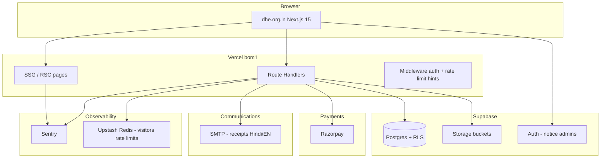

# DHE Website — Master Audit Consolidation & Restructure Plan

**Site:** [www.dhe.org.in](https://www.dhe.org.in)  
**Scope:** Full redesign, Firebase retirement, Supabase + Razorpay + SMTP, institutional truth  
**Status:** Implementation in production (see `EXHAUSTIVE_RESTRUCTURE_PLAN.md` for live checklist)  
**Last updated:** 2026-07-03

---

## 1. Executive summary

The Department of Holistic Education (DHE) website is a **national institutional platform** (25+ cells, year-round programs) that today behaves like a **Shiksha Mahakumbh microsite** with **Firebase-backed forms**, **no CI/CD**, **weak legal/compliance**, and **no measurable conversion stack**.

This plan consolidates **every audit** into one problem register and defines a **phased restructure**:

| Pillar | Today | Target |
|--------|-------|--------|
| Data | Firebase client SDK (Firestore + Storage) | **Supabase** (Postgres + Storage + Auth + RLS) |
| Payments | Jodo link + manual receipt upload | **Razorpay** + auto PDF receipt + email |
| Email | Stale workshop SMTP API only | **SMTP** (receipts, Hindi thanks, admin alerts) |
| Content | SMK-heavy, stale events, no programs hub | **DHE-first** `programs/registry` + cells |
| Governance | Broken legal links, `/Members` PII leak | Privacy, terms, LMC from Letter 12, 80G block |
| Ops | Vercel push-only | CI + Sentry + backups + `llms.txt` |
| Leadership | Stale `/committee` | LMC + patrons + downloadable nomination PDFs |

**North star:** One trustworthy national portal where **programs, cells, leadership, notices, donations, and membership** are first-class — not an event landing page with Firebase forms bolted on.

---

## 2. Consolidated problem register (all audits)

Problems are grouped by domain. **P0** = ship-blocker / trust-risk; **P1** = restructure wave 1; **P2** = wave 2; **P3** = polish.

### 2.1 Brand, content & information architecture

| ID | Priority | Problem |
|----|----------|---------|
| C-01 | P0 | Homepage CTAs, marquee, modal, FAQ dominate **Shiksha Mahakumbh**; flagship DHE programs nearly invisible |
| C-02 | P0 | **Stale / conflicting events** (SMK 5.0 concluded vs “upcoming”; 2025 rows still “Planned”) |
| C-03 | P0 | No **`programs/registry`** — Olympiads, Super 100, Hawan, publications not mapped to cells |
| C-04 | P1 | Publications split across `/books`, `/journals`, `pub.dhe.org.in` |
| C-05 | P1 | Footer links **`/privacy-policy`**, **`/terms`** → 404 |
| C-06 | P1 | Three visual tiers (modern home vs legacy books/membership) |
| C-07 | P2 | Digital ecosystem cards (Tredul, Sarvatra…) text-only, no links |
| C-08 | P2 | Hindi content only in promo modal i18n; pages English-only |
| C-09 | P2 | `CONTENT_OPERATIONS.md` exists but no CMS — all copy in TS/JSON |

### 2.2 SEO, structured data & AI discoverability

| ID | Priority | Problem |
|----|----------|---------|
| S-01 | P0 | Home **title template duplicates** brand in `<title>` |
| S-02 | P1 | **25 near-identical** cell meta descriptions |
| S-03 | P1 | Invalid **`SearchAction`** in WebSite schema (no site search) |
| S-04 | P1 | Legacy **`public/sitemap.xml`** malformed (HTTP, stale paths) |
| S-05 | P1 | No **`llms.txt`**; weak AI/crawler manifest |
| S-06 | P2 | Single 512×512 OG image on all pages |
| S-07 | P2 | ~15 public pages have metadata but **no JSON-LD** |
| S-08 | P2 | No **`Event`** schema on upcoming/past events |
| S-09 | P3 | No `id` anchors on cell H2 sections for deep links / RAG |

### 2.3 UX, accessibility & performance

| ID | Priority | Problem |
|----|----------|---------|
| U-01 | P0 | Hero image **~1.9 MB** + logo **~570 KB** → poor mobile LCP |
| U-02 | P1 | **Double sticky header**; promo modal @ 3s → CLS |
| U-03 | P1 | No **skip-to-main** link |
| U-04 | P1 | Footer contact form: **placeholders not labels** |
| U-05 | P1 | `/advisory`, `/committee` missing **H1** |
| U-06 | P1 | Marquee/carousel: no **`prefers-reduced-motion`** |
| U-07 | P2 | `/noticeboard` **416 kB** JS (Ant Design) |
| U-08 | P2 | Firebase + Ant Design in **root layout** → every route heavy |
| U-09 | P2 | `images.unoptimized` on Vercel (Hobby workaround) |

### 2.4 Security, privacy & compliance

| ID | Priority | Problem |
|----|----------|---------|
| X-01 | P0 | **`/Members`** exposes member email/phone from Firestore publicly |
| X-02 | P0 | **No Firestore rules in repo**; client writes from browser |
| X-03 | P0 | No **privacy policy / terms** pages (footer promises them) |
| X-04 | P0 | **AdSense + Botpress** without cookie consent |
| X-05 | P1 | HTTP Basic admin auth; **no CSP** |
| X-06 | P1 | **`eval()`** in `FeedbackForm.tsx` |
| X-07 | P1 | Donation page: no **80G / trust legal** disclosure (VBITR Trust) |
| X-08 | P1 | No **reCAPTCHA** on public forms |
| X-09 | P2 | `/Members` indexed in sitemap |
| X-10 | P2 | GA4 ID configured but **never initialized** |
| X-11 | P2 | Hardcoded Firebase defaults → preview bleeds into prod data |

### 2.5 Data layer & API (Firebase era)

| ID | Priority | Problem |
|----|----------|---------|
| D-01 | P0 | **All dynamic data in Firebase** — no backup/export in repo |
| D-02 | P0 | Collections: `events`, `visitors`, `contactMessages`, `Donation`, `Feedback`, `RegestrationVol` (typo), `Workshop` |
| D-03 | P1 | No pagination; admin **`getDocs` full scans** |
| D-04 | P1 | Single RPC API **`POST /api/sendMail`** — stale May 2024 workshop template |
| D-05 | P1 | Visitor counter: **hot-doc writes** + persistent `onSnapshot` in footer |
| D-06 | P2 | Notice images in Storage `files/*` — no lifecycle policy |
| D-07 | P2 | No data retention policy documented |

### 2.6 Rendering & resilience (Next.js)

| ID | Priority | Problem |
|----|----------|---------|
| R-01 | P1 | **`RootLayoutClient`** wraps entire chrome — heavy hydration |
| R-02 | P1 | No **`error.tsx`**, **`loading.tsx`**, root **`not-found.tsx`** |
| R-03 | P2 | `/structure` triple-deferred (client + lazy + `ssr: false`) |
| R-04 | P2 | Notices, members, structure **client-only** → poor crawl/LLM |
| R-05 | P3 | `reactStrictMode: false` |

### 2.7 Operations & infrastructure

| ID | Priority | Problem |
|----|----------|---------|
| O-01 | P0 | **No CI/CD** (lint/build not gated on PR) |
| O-02 | P0 | **No Firestore backup** / DR runbook |
| O-03 | P1 | No **Sentry** / structured logging |
| O-04 | P1 | No **alerting** or uptime checks |
| O-05 | P2 | Duplicate Vercel project risk (`dhe-orgin` vs `dhe-orgin-ctai`) |
| O-06 | P2 | No Docker/IaC for Firebase rules (console-only drift) |

### 2.8 Marketing & conversion

| ID | Priority | Problem |
|----|----------|---------|
| M-01 | P1 | Primary conversion **exits to rase.co.in** — untracked |
| M-02 | P1 | No **thank-you pages**, no confirmation email on donate/join |
| M-03 | P2 | No newsletter / owned audience |
| M-04 | P2 | No GA4 events / GTM funnel |
| M-05 | P3 | No share buttons / per-event OG images |

### 2.9 Governance & receipts (new — from your documents)

| ID | Priority | Problem |
|----|----------|---------|
| G-01 | P0 | **`/committee`** list is **Letter 04 (2023)** — superseded by **Letter 12 (Dec 2025)** |
| G-02 | P0 | Official address/phone outdated on site vs **Sunny Enclave + 7903431900** |
| G-03 | P1 | LMC PDFs not linked on public **Leadership / LMC** page |
| G-04 | P1 | Receipt header defined in code but **no PDF generator** wired |
| G-05 | P1 | Donations to “DHE” account vs **80G entity VBITR Trust** unclear |
| G-06 | P2 | Three LMC terms + coordinator letter — need **history timeline** UI |

---

## 3. Target architecture



### 3.1 Stack decisions

| Layer | Choice | Notes |
|-------|--------|-------|
| **Database** | **Supabase Postgres** | Replaces all Firestore collections |
| **Files** | **Supabase Storage** | Notices, receipt PDFs, LMC PDFs (mirror `public/lmc`) |
| **Auth** | **Supabase Auth** | Notice admins (replace Firebase Auth + email allowlist) |
| **Payments** | **Razorpay** | Donations + membership fees; webhooks → receipt job |
| **Email** | **SMTP** (existing Gmail or transactional provider) | Receipt PDF attach + Hindi thanks body |
| **Rate limiting** | **Upstash Redis** | Visitor count, form spam, API abuse |
| **Errors** | **Sentry** | Client + server |
| **Neon** | **Not required** if Supabase Postgres is primary | Use only if you split read replicas later |
| **Visitor count** | **Upstash INCR** or **Supabase daily aggregate** | Replace Firebase hot docs |

### 3.2 Firebase — complete retirement

| Firebase use | Supabase replacement |
|--------------|---------------------|
| `events` (notices) | `notices` table + Storage bucket `notices` |
| `visitors` | `visitor_stats` table or Upstash keys |
| `contactMessages` | `contact_messages` |
| `Donation` | `donations` + Razorpay `payment_id` |
| `Feedback` | `feedback` |
| `RegestrationVol` | `memberships` + Razorpay |
| `Workshop` | `workshop_registrations` (archive import) |
| Firebase Auth (notice admin) | Supabase Auth + `admin_users` / role claim |
| Firebase Storage | Supabase Storage |
| Client SDK in layout | **Remove** — server actions + API only |

**Delete after migration:** `src/app/firebase`, `src/services/firebase`, all `firebase` imports, `NEXT_PUBLIC_FIREBASE_*` env vars.

---

## 4. Supabase data model (initial)

```sql
-- Core
notices (id, title, body, image_path, published_at, expires_at, is_pinned, created_by)
notice_revisions (audit trail)

contact_messages (id, email, message, ip_hash, created_at)
feedback (id, name, email, mobile, affiliation, event, experience, suggestions, created_at)

-- Payments
donations (
  id, razorpay_order_id, razorpay_payment_id, amount_paise, currency,
  donor_name, donor_email, donor_phone, donor_pan, donor_address,
  purpose, status, receipt_number, receipt_pdf_path, created_at
)
memberships (
  id, razorpay_*, fee_category, fee_type, amount_paise,
  name, address, email, phone, services, fee_receipt_path,
  status, receipt_number, receipt_pdf_path, created_at
)

-- Governance (optional DB mirror of src/data)
lmc_terms (id, ref_no, valid_from, valid_to, pdf_path, office_address, is_current)
lmc_members (term_id, role, name, designation, contact, address, details, sort_order)

-- Ops
visitor_daily (date, total_count)  -- or Upstash only
admin_users (user_id, email, role)  -- notice_editor, finance, super
```

**RLS:** Public read on published `notices`; insert on forms via **service role API** only (never direct client insert). Finance tables admin-only.

---

## 5. Payments & receipts (Razorpay + SMTP)

### 5.1 Flows

**Donation**
1. User fills form (name, email, phone, PAN, address, amount, purpose) + **reCAPTCHA v3**
2. Server creates Razorpay order → client checkout
3. Webhook `payment.captured` → verify signature
4. Generate **PDF receipt** (`receipt-and-lmc.ts` header + receipt number)
5. Email via SMTP: PDF attach + **Hindi thanks** + English summary
6. Show **download receipt** on thank-you page

**Membership**
1. Select category (student/other) + lifetime/annual → computed fee
2. Same Razorpay + receipt + email
3. **No public `/Members` directory** — optional admin-only roster

**Registration (events / workshops)**
1. Concise registration form per program (from `programs/registry`)
2. Free events: SMTP confirmation only
3. Paid events: Razorpay path above

### 5.2 Receipt content (from your spec)

```
[DHE LOGO]
Regd. No. 6401 Date: 10-11-2023
PAN: AAETV1652K

DEPARTMENT OF HOLISTIC EDUCATION
A UNIT OF
VIDYA BHARTI INSTITUTE OF TRAINING AND RESEARCH TRUST

E-7, Orchid Towers, Sector 125, Sunny Enclave, SAS Nagar, Punjab-140301
Web. dhe.org.in, E-mail: director@dhe.org.in
Tel: 7903431900

[Registration Receipt | Donation Receipt]
Receipt No. DHE-2026-00001
Date: ...
Amount: ...
Razorpay Payment ID: ...
80G note (if donation): Provisional approval AAETV1652KF20241, AY 2024-25–2026-27
```

Source of truth: `src/data/institution/receipt-and-lmc.ts`  
PDF engine: `@react-pdf/renderer` or `pdfkit` on server (match format you will send).

### 5.3 SMTP templates

| Template | Language | Trigger |
|----------|----------|---------|
| `receipt-donation` | EN + HI body | Payment success |
| `receipt-membership` | EN + HI | Payment success |
| `registration-confirm` | EN + HI | Free registration |
| `contact-notify-admin` | EN | Footer/contact form |
| `contact-thanks` | EN + HI | Auto-reply to user |

Retire: hardcoded **May 2024 workshop** `sendMail` HTML.

---

## 6. Information architecture (restructure)

### 6.1 New / reworked routes

| Route | Purpose |
|-------|---------|
| `/` | DHE-first home; SMK as one program card |
| `/programs` | Hub from `programs/registry.ts` |
| `/programs/[slug]` | Program landing (Olympiad, SMK, Super 100, …) |
| `/cells/[slug]` | Keep — mandate + enrichment |
| `/leadership` or `/governance` | LMC current + patrons + PDF downloads |
| `/committee` | Redirect → `/leadership#lmc` or merge |
| `/notices` | Rename from `/noticeboard` (optional redirect) |
| `/donate` | Razorpay + 80G block (alias `/donation`) |
| `/join` | Membership Razorpay (alias `/contribute`) |
| `/contact` | Form → Supabase + SMTP |
| `/privacy-policy`, `/terms` | Legal |
| `/workshops` | Archive + future registrations |
| `/llms.txt` | AI manifest |

### 6.2 Program → cell mapping (from prior audit)

| Program | Cell(s) |
|---------|---------|
| Shiksha Mahakumbh | Event Management |
| DHE Olympiads | Olympiad |
| Student Projects | ATL |
| Model Couple | Parenting |
| Donations | CSR |
| IPR / Bharat Pratibha Kosh | IPR |
| Journals, MTC, books | Publications & Promotions |
| Hawan | Spiritual |
| IT platforms | IT |
| Super 100 | Super 100 |
| Conclaves | HEI + Industry |
| Bal Shodh Patrika | Udyam + Publications |

### 6.3 Leadership / LMC page content

**Current term (Letter 12, 03.12.2025 – 03.12.2028)**  
- Office: E-7, Orchid Towers, Sector 125, Sunny Enclave, SAS Nagar 140301  
- Patrons + 14 members from `lmcCurrentPatrons` / `lmcCurrentMembers`  
- Bank rule: any **two** of President, Manager, Treasurer  

**Historical terms (PDFs in `public/lmc/`)**
| PDF | Term | Office |
|-----|------|--------|
| letter-12-lmc-update-2.pdf | 2025–2028 | Sunny Enclave |
| letter-04-lmc-dhe.pdf | 2023–2026 | Sector-71 Mohali |
| letter-455-lmc-mohali.pdf | 2023–2026 | Sector-71 Mohali |
| letter-01-coordinator.pdf | Sonu Sharma LMS coordinator | — |

Also surface: **Director's Message**, **Advisory Council**, **Cell Co-ordinators** (`/people`) under Leadership hub.

---

## 7. Notice board (upgrade plan)

| Today | Target |
|-------|--------|
| Client `getDocs` all events | Server component: fetch published notices (ISR `revalidate: 300`) |
| Ant Design heavy UI | Lightweight list + optional admin Ant Design **scoped to admin route only** |
| No expiry | `expires_at` — auto-hide stale |
| No RSS | `/feed.xml` for notices + programs |
| Images from Firebase Storage | Supabase Storage + Next Image |

**Admin:** `/admin/notices` — Supabase Auth, CRUD, image upload, preview.

---

## 8. Visitor count

| Option | Pros |
|--------|------|
| **Upstash INCR** `visitors:YYYY-MM-DD` | Fast, no DB write amplification |
| **Supabase** `visitor_daily` upsert | Single stack, daily rollup via cron |

Recommendation: **Upstash** for edge-friendly increments + **daily aggregate job** to Supabase for reporting. Remove footer `onSnapshot` entirely.

---

## 9. Security & compliance (restructure gates)

| Item | Action |
|------|--------|
| reCAPTCHA v3 | All public POST endpoints |
| Rate limit | Upstash per IP on contact/donate/register |
| RLS | Supabase policies — no public write |
| Cookie banner | Block AdSense/Botpress until consent |
| Privacy + terms | Publish before go-live |
| `/Members` | **Retire public page** or admin-only |
| CSP | Report-Only → enforce |
| Sentry | PII scrubbing on form breadcrumbs |

---

## 10. Observability & CI

```yaml
# Target CI (GitHub Actions)
- npm ci && npm run lint && npx tsc --noEmit && VERCEL=1 npm run build
```

| Tool | Use |
|------|-----|
| **Sentry** | Errors, performance traces |
| **Upstash** | Rate limits, visitor count |
| **Vercel Analytics / GA4** | Funnels after consent |
| **Uptime** | Check `/` + `/api/health` |

---

## 11. Retirement list (remove or replace)

### 11.1 Remove completely

- Firebase SDK + all `firebase` env vars
- `src/app/firebase`, `src/services/firebase`
- Public **`/Members`** directory (PII)
- Jodo pay link as primary (→ Razorpay)
- Manual “upload donation receipt” step post-payment
- `FeedbackForm` `eval()` pattern
- Legacy `public/sitemap.xml`
- Duplicate Vercel project `dhe-orgin` (keep `dhe-orgin-ctai`)
- Workshop 2024 bulk email template in `sendMail`
- Phone **7627888222** everywhere (use **7903431900**)
- Old Mohali-only address as sole contact (retain Kurukshetra as **trust registered office** in 80G footnote)

### 11.2 Replace / merge

| Old | New |
|-----|-----|
| `/committee` static array | `/leadership` from `receipt-and-lmc.ts` + Letter 12 |
| `/donation` + upload receipt | Razorpay + auto PDF |
| `/contribute` + manual fee upload | Razorpay membership |
| `/noticeboarddata` Firebase admin | `/admin/notices` Supabase |
| `/donationdatadekh`, `/WD` | `/admin/finance` Supabase + export |
| Footer Firestore contact | API → Supabase + email admin |
| `HomePromoDialog` SMK interstitial | Program card on home (optional dismissible banner) |
| Client visitor Firebase | Upstash |

### 11.3 Keep (refactor)

- `registry.json` + cell enrichment pattern
- `pages-registry.ts` SEO pipeline
- `receipt-and-lmc.ts` institution record
- `public/lmc/*.pdf`
- Most static marketing pages (refreshed copy)
- Vercel hosting `bom1`

---

## 12. Additional features to add (backlog)

| Feature | Value |
|---------|-------|
| **Programs hub** | National identity |
| **Event registrations** | Per-program Razorpay/free |
| **WhatsApp** | Keep float → `7903431900`; track clicks |
| **Newsletter** | Brevo/Resend + consent |
| **Publications hub** | Unify books/journals/external pub |
| **Search** | Pagefind or Algolia — then fix SearchAction schema |
| **Hindi UI** | `/hi` routes or next-intl |
| **Certificate verify** | `/receipt/verify/[id]` QR on PDF |
| **Annual report / transparency** | CSR + donation summary PDF |
| **Cell coordinator sync** | Single `people/registry.json` |
| **Workshop gallery** | Past workshops with photos |
| **Botpress** | Keep post-consent or replace with FAQ |

---

## 13. Implementation phases

### Phase 0 — Foundation (week 1–2)

- [ ] CI workflow (lint, tsc, build)
- [ ] Sentry project + env
- [ ] Supabase project: schema migration v1
- [ ] Privacy policy + terms pages (stub → legal review)
- [ ] Fix P0 SEO: title template, delete bad sitemap
- [ ] `llms.txt`
- [ ] Env map (section 14) on Vercel + local

### Phase 1 — Data migration (week 2–4)

- [ ] Export Firestore → JSON backup
- [ ] Import scripts → Supabase
- [ ] Supabase Storage: notices images
- [ ] Remove Firebase from `package.json`
- [ ] Server-side notices read (ISR)
- [ ] reCAPTCHA + Upstash rate limits on APIs

### Phase 2 — Payments & receipts (week 4–6)

- [ ] Razorpay keys + webhook route
- [ ] Donation flow + 80G copy + trust disclosure
- [ ] Membership flow + fee table
- [ ] PDF receipt generator (your format)
- [ ] SMTP templates (EN + Hindi thanks)
- [ ] Thank-you pages + receipt download
- [ ] Admin finance dashboard (replace donationdatadekh)

### Phase 3 — Governance & content (week 6–8)

- [ ] `/leadership` — LMC Letter 12 + PDF archive
- [ ] Sync contact address / phone site-wide from `receipt-and-lmc.ts`
- [ ] `programs/registry.ts` + hub page
- [ ] Homepage DHE-first redesign
- [ ] Events registry + fix stale rows
- [ ] `/committee` → leadership redirect

### Phase 4 — UX, perf, legal hardening (week 8–10)

- [ ] Compress hero/logo; image optimization strategy
- [ ] Slim layout client boundary
- [ ] `error.tsx` / `not-found.tsx`
- [ ] Cookie consent CMP
- [ ] GA4 + conversion events
- [ ] Accessibility: skip link, labels, reduced motion
- [ ] Notice RSS feed

### Phase 5 — Admin & ops (week 10–12)

- [ ] Supabase Auth admin panel (notices, exports)
- [ ] Firestore decommission confirmation
- [ ] Backup cron + DR doc
- [ ] Load test visitor + payment webhooks

---

## 14. Environment variables map

### Remove (Firebase)

```
NEXT_PUBLIC_FIREBASE_API_KEY
NEXT_PUBLIC_FIREBASE_AUTH_DOMAIN
NEXT_PUBLIC_FIREBASE_PROJECT_ID
NEXT_PUBLIC_FIREBASE_STORAGE_BUCKET
NEXT_PUBLIC_FIREBASE_MESSAGING_SENDER_ID
NEXT_PUBLIC_FIREBASE_APP_ID
NEXT_PUBLIC_FIREBASE_MEASUREMENT_ID
NEXT_PUBLIC_NOTICE_ADMIN_EMAILS  → replace with Supabase roles
```

### Add — Supabase

```
NEXT_PUBLIC_SUPABASE_URL
NEXT_PUBLIC_SUPABASE_ANON_KEY
SUPABASE_SERVICE_ROLE_KEY
```

### Add — Razorpay

```
RAZORPAY_KEY_ID
RAZORPAY_KEY_SECRET
RAZORPAY_WEBHOOK_SECRET
```

### Add — SMTP (keep / extend)

```
SMTP_SERVICE
SMTP_USER
SMTP_PASS
SMTP_FROM
```

### Add — Security & ops

```
RECAPTCHA_SITE_KEY
RECAPTCHA_SECRET_KEY
SENTRY_DSN
SENTRY_AUTH_TOKEN          # CI upload
UPSTASH_REDIS_REST_URL
UPSTASH_REDIS_REST_TOKEN
```

### Keep

```
ADMIN_USERNAME / ADMIN_PASSWORD   # Until Supabase admin fully replaces Basic auth
```

---

## 15. What you will provide (waiting on you)

| Item | For |
|------|-----|
| Razorpay live/test keys | Payment integration |
| Receipt PDF **final design** (Hindi block text) | PDF generator |
| Membership fee amounts confirmation | Checkout |
| SMTP provider choice (Gmail vs Resend/SendGrid) | Deliverability |
| 80G / 12A PDFs in `public/accounts/` | Donation page downloads |
| Legal sign-off on privacy/terms Hindi+EN | Compliance |
| Firestore export access | Migration |
| Program list priorities | `programs/registry` content |

---

## 16. Success criteria (go-live)

- [ ] Zero Firebase references in build
- [ ] Donation + membership complete with Razorpay test payment → PDF in email + download
- [ ] Notices load without client Firebase
- [ ] LMC page matches Letter 12; all 4 PDFs downloadable
- [ ] No public PII directory
- [ ] Privacy + terms live; cookie consent active
- [ ] CI green; Sentry receiving events
- [ ] Lighthouse mobile LCP &lt; 2.5s on home (after image fix)
- [ ] `7903431900` + Sunny Enclave on contact/footer/receipts only

---

## 17. Document index (audit sources merged here)

| Audit domain | Key P0 problems |
|--------------|-----------------|
| Environment | Hardcoded Firebase; admin 503 without env |
| Content | SMK dominance; stale events; no programs registry |
| SEO | Title bug; bad sitemap; SearchAction |
| Communications | Brand inconsistency; no legal pages |
| UX/Design | Competing primaries; double header |
| Accessibility | No skip link; form labels |
| Core Web Vitals | 1.9MB hero; CLS modal |
| Assets/Bundles | Ant Design in root; noticeboard 416kB |
| Security | No CSP; Members PII; eval |
| Operations | No CI; no backups |
| Data/API | Firestore no rules; one stale API |
| Next.js rendering | No error boundaries; client shell |
| CI/CD & infra | No pipelines; no monitoring |
| Legal | No GDPR/cookies; 80G undisclosed |
| Marketing | Untracked SMK exit; no receipts |
| Structured/AI | No llms.txt; client notices |
| Governance | LMC outdated; receipt header ready in code |

---

**Next step:** Review this plan → confirm Razorpay + Supabase project ownership → begin **Phase 0** (CI + Supabase schema + legal stubs). Implementation PRs should be split by phase for review.
